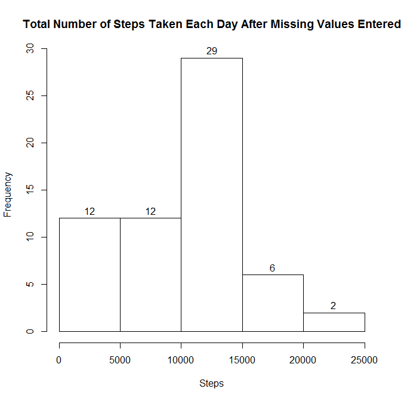

# Reproducible Research: Peer Assessment 1


## Loading and preprocessing the data

```r
# clear all variables
rm(list = ls(all = TRUE))
```

### Load the data (i.e. read.csv())
Read CSV into R

```r
step_data <- read.csv(unz("activity.zip", "activity.csv")
                      , header = TRUE 
                      ,sep = ",")

names(step_data)
```

```
## [1] "steps"    "date"     "interval"
```

```r
nrow(step_data)
```

```
## [1] 17568
```

### Process/transform the data (if necessary) into a format suitable for your analysis


## What is mean total number of steps taken per day?


### Make a histogram of the total number of steps taken each day

```r
# sum steps by date
step_data.sum <- aggregate(step_data$steps ~ step_data$date
                           , data = step_data
                           , FUN = sum)
colnames(step_data.sum) <- c("date", "steps")

# LL:  step_data.sum$steps = step_data.sum[[2]] = step_data.sum[,2]
hist(step_data.sum$steps
     , main = "Total Number of Steps Taken Each Day"
     , xlab = "Steps"
     , labels = TRUE)
```

 


### Calculate and report the mean and median total number of steps taken per day

```r
step_data.mean <- aggregate(step_data$steps ~ step_data$date
                            , data = step_data
                            , FUN = mean)
colnames(step_data.mean) <- c("date", "mean")

step_data.median <- aggregate(step_data$steps ~ step_data$date
                              , data = step_data
                              , FUN = median)
colnames(step_data.median) <- c("date", "median")

step_data.mean.median <- merge(step_data.mean, step_data.median)

# determine mean and median of raw dataset ignoring NA values
step_data_mean <- mean(step_data$steps, na.rm=TRUE)
step_data_median <- median(step_data$steps, na.rm=TRUE)
```

The mean and median for the raw step date ignoring NA values is 37.3826 and 0, respectively.

The mean and median values for a given date are as followed:

```r
library(xtable)
xt_base <- xtable(step_data.mean.median)
print(xt_base, type="html")
```

<!-- html table generated in R 3.0.3 by xtable 1.7-3 package -->
<!-- Thu Aug 14 21:50:39 2014 -->
<TABLE border=1>
<TR> <TH>  </TH> <TH> date </TH> <TH> mean </TH> <TH> median </TH>  </TR>
  <TR> <TD align="right"> 1 </TD> <TD> 2012-10-02 </TD> <TD align="right"> 0.44 </TD> <TD align="right"> 0.00 </TD> </TR>
  <TR> <TD align="right"> 2 </TD> <TD> 2012-10-03 </TD> <TD align="right"> 39.42 </TD> <TD align="right"> 0.00 </TD> </TR>
  <TR> <TD align="right"> 3 </TD> <TD> 2012-10-04 </TD> <TD align="right"> 42.07 </TD> <TD align="right"> 0.00 </TD> </TR>
  <TR> <TD align="right"> 4 </TD> <TD> 2012-10-05 </TD> <TD align="right"> 46.16 </TD> <TD align="right"> 0.00 </TD> </TR>
  <TR> <TD align="right"> 5 </TD> <TD> 2012-10-06 </TD> <TD align="right"> 53.54 </TD> <TD align="right"> 0.00 </TD> </TR>
  <TR> <TD align="right"> 6 </TD> <TD> 2012-10-07 </TD> <TD align="right"> 38.25 </TD> <TD align="right"> 0.00 </TD> </TR>
  <TR> <TD align="right"> 7 </TD> <TD> 2012-10-09 </TD> <TD align="right"> 44.48 </TD> <TD align="right"> 0.00 </TD> </TR>
  <TR> <TD align="right"> 8 </TD> <TD> 2012-10-10 </TD> <TD align="right"> 34.38 </TD> <TD align="right"> 0.00 </TD> </TR>
  <TR> <TD align="right"> 9 </TD> <TD> 2012-10-11 </TD> <TD align="right"> 35.78 </TD> <TD align="right"> 0.00 </TD> </TR>
  <TR> <TD align="right"> 10 </TD> <TD> 2012-10-12 </TD> <TD align="right"> 60.35 </TD> <TD align="right"> 0.00 </TD> </TR>
  <TR> <TD align="right"> 11 </TD> <TD> 2012-10-13 </TD> <TD align="right"> 43.15 </TD> <TD align="right"> 0.00 </TD> </TR>
  <TR> <TD align="right"> 12 </TD> <TD> 2012-10-14 </TD> <TD align="right"> 52.42 </TD> <TD align="right"> 0.00 </TD> </TR>
  <TR> <TD align="right"> 13 </TD> <TD> 2012-10-15 </TD> <TD align="right"> 35.20 </TD> <TD align="right"> 0.00 </TD> </TR>
  <TR> <TD align="right"> 14 </TD> <TD> 2012-10-16 </TD> <TD align="right"> 52.38 </TD> <TD align="right"> 0.00 </TD> </TR>
  <TR> <TD align="right"> 15 </TD> <TD> 2012-10-17 </TD> <TD align="right"> 46.71 </TD> <TD align="right"> 0.00 </TD> </TR>
  <TR> <TD align="right"> 16 </TD> <TD> 2012-10-18 </TD> <TD align="right"> 34.92 </TD> <TD align="right"> 0.00 </TD> </TR>
  <TR> <TD align="right"> 17 </TD> <TD> 2012-10-19 </TD> <TD align="right"> 41.07 </TD> <TD align="right"> 0.00 </TD> </TR>
  <TR> <TD align="right"> 18 </TD> <TD> 2012-10-20 </TD> <TD align="right"> 36.09 </TD> <TD align="right"> 0.00 </TD> </TR>
  <TR> <TD align="right"> 19 </TD> <TD> 2012-10-21 </TD> <TD align="right"> 30.63 </TD> <TD align="right"> 0.00 </TD> </TR>
  <TR> <TD align="right"> 20 </TD> <TD> 2012-10-22 </TD> <TD align="right"> 46.74 </TD> <TD align="right"> 0.00 </TD> </TR>
  <TR> <TD align="right"> 21 </TD> <TD> 2012-10-23 </TD> <TD align="right"> 30.97 </TD> <TD align="right"> 0.00 </TD> </TR>
  <TR> <TD align="right"> 22 </TD> <TD> 2012-10-24 </TD> <TD align="right"> 29.01 </TD> <TD align="right"> 0.00 </TD> </TR>
  <TR> <TD align="right"> 23 </TD> <TD> 2012-10-25 </TD> <TD align="right"> 8.65 </TD> <TD align="right"> 0.00 </TD> </TR>
  <TR> <TD align="right"> 24 </TD> <TD> 2012-10-26 </TD> <TD align="right"> 23.53 </TD> <TD align="right"> 0.00 </TD> </TR>
  <TR> <TD align="right"> 25 </TD> <TD> 2012-10-27 </TD> <TD align="right"> 35.14 </TD> <TD align="right"> 0.00 </TD> </TR>
  <TR> <TD align="right"> 26 </TD> <TD> 2012-10-28 </TD> <TD align="right"> 39.78 </TD> <TD align="right"> 0.00 </TD> </TR>
  <TR> <TD align="right"> 27 </TD> <TD> 2012-10-29 </TD> <TD align="right"> 17.42 </TD> <TD align="right"> 0.00 </TD> </TR>
  <TR> <TD align="right"> 28 </TD> <TD> 2012-10-30 </TD> <TD align="right"> 34.09 </TD> <TD align="right"> 0.00 </TD> </TR>
  <TR> <TD align="right"> 29 </TD> <TD> 2012-10-31 </TD> <TD align="right"> 53.52 </TD> <TD align="right"> 0.00 </TD> </TR>
  <TR> <TD align="right"> 30 </TD> <TD> 2012-11-02 </TD> <TD align="right"> 36.81 </TD> <TD align="right"> 0.00 </TD> </TR>
  <TR> <TD align="right"> 31 </TD> <TD> 2012-11-03 </TD> <TD align="right"> 36.70 </TD> <TD align="right"> 0.00 </TD> </TR>
  <TR> <TD align="right"> 32 </TD> <TD> 2012-11-05 </TD> <TD align="right"> 36.25 </TD> <TD align="right"> 0.00 </TD> </TR>
  <TR> <TD align="right"> 33 </TD> <TD> 2012-11-06 </TD> <TD align="right"> 28.94 </TD> <TD align="right"> 0.00 </TD> </TR>
  <TR> <TD align="right"> 34 </TD> <TD> 2012-11-07 </TD> <TD align="right"> 44.73 </TD> <TD align="right"> 0.00 </TD> </TR>
  <TR> <TD align="right"> 35 </TD> <TD> 2012-11-08 </TD> <TD align="right"> 11.18 </TD> <TD align="right"> 0.00 </TD> </TR>
  <TR> <TD align="right"> 36 </TD> <TD> 2012-11-11 </TD> <TD align="right"> 43.78 </TD> <TD align="right"> 0.00 </TD> </TR>
  <TR> <TD align="right"> 37 </TD> <TD> 2012-11-12 </TD> <TD align="right"> 37.38 </TD> <TD align="right"> 0.00 </TD> </TR>
  <TR> <TD align="right"> 38 </TD> <TD> 2012-11-13 </TD> <TD align="right"> 25.47 </TD> <TD align="right"> 0.00 </TD> </TR>
  <TR> <TD align="right"> 39 </TD> <TD> 2012-11-15 </TD> <TD align="right"> 0.14 </TD> <TD align="right"> 0.00 </TD> </TR>
  <TR> <TD align="right"> 40 </TD> <TD> 2012-11-16 </TD> <TD align="right"> 18.89 </TD> <TD align="right"> 0.00 </TD> </TR>
  <TR> <TD align="right"> 41 </TD> <TD> 2012-11-17 </TD> <TD align="right"> 49.79 </TD> <TD align="right"> 0.00 </TD> </TR>
  <TR> <TD align="right"> 42 </TD> <TD> 2012-11-18 </TD> <TD align="right"> 52.47 </TD> <TD align="right"> 0.00 </TD> </TR>
  <TR> <TD align="right"> 43 </TD> <TD> 2012-11-19 </TD> <TD align="right"> 30.70 </TD> <TD align="right"> 0.00 </TD> </TR>
  <TR> <TD align="right"> 44 </TD> <TD> 2012-11-20 </TD> <TD align="right"> 15.53 </TD> <TD align="right"> 0.00 </TD> </TR>
  <TR> <TD align="right"> 45 </TD> <TD> 2012-11-21 </TD> <TD align="right"> 44.40 </TD> <TD align="right"> 0.00 </TD> </TR>
  <TR> <TD align="right"> 46 </TD> <TD> 2012-11-22 </TD> <TD align="right"> 70.93 </TD> <TD align="right"> 0.00 </TD> </TR>
  <TR> <TD align="right"> 47 </TD> <TD> 2012-11-23 </TD> <TD align="right"> 73.59 </TD> <TD align="right"> 0.00 </TD> </TR>
  <TR> <TD align="right"> 48 </TD> <TD> 2012-11-24 </TD> <TD align="right"> 50.27 </TD> <TD align="right"> 0.00 </TD> </TR>
  <TR> <TD align="right"> 49 </TD> <TD> 2012-11-25 </TD> <TD align="right"> 41.09 </TD> <TD align="right"> 0.00 </TD> </TR>
  <TR> <TD align="right"> 50 </TD> <TD> 2012-11-26 </TD> <TD align="right"> 38.76 </TD> <TD align="right"> 0.00 </TD> </TR>
  <TR> <TD align="right"> 51 </TD> <TD> 2012-11-27 </TD> <TD align="right"> 47.38 </TD> <TD align="right"> 0.00 </TD> </TR>
  <TR> <TD align="right"> 52 </TD> <TD> 2012-11-28 </TD> <TD align="right"> 35.36 </TD> <TD align="right"> 0.00 </TD> </TR>
  <TR> <TD align="right"> 53 </TD> <TD> 2012-11-29 </TD> <TD align="right"> 24.47 </TD> <TD align="right"> 0.00 </TD> </TR>
   </TABLE>


## What is the average daily activity pattern?


### Make a time series plot (i.e. type = "l") of the 5-minute interval (x-axis) and the average number of steps taken, averaged across all days (y-axis)

```r
step_data.ts_avg <- aggregate(step_data$steps ~ step_data$interval
                              , data = step_data
                              , FUN = mean
                              , na.rm = TRUE)
colnames(step_data.ts_avg) <- c("interval", "steps")
plot(x = step_data.ts_avg$interval
     , y = step_data.ts_avg$steps
     , main = "Daily Avg Number of Steps Per 5-Minute Interval"
     , xlab = "Interval"
     , ylab = "Number of steps"
     , type = "l")
```

 

```r
# identify row with maximum number of steps
max_num_step_row <- step_data.ts_avg$steps == max(step_data.ts_avg$steps);
rec_max_num_steps <- step_data.ts_avg[max_num_step_row,];
```

### Which 5-minute interval, on average across all the days in the dataset, contains the maximum number of steps?
The 5-minute interval, on average across all the days, which contains the maximum number of steps is 835 [for 206.1698 steps]


## Imputing missing values


### Calculate and report the total number of missing values in the dataset (i.e. the total number of rows with NAs)

```r
complete_recs <- complete.cases(step_data)
```
The total number of incomplete is records is 2304 [13.1148% incomplete]


### Devise a strategy for filling in all of the missing values in the dataset. The strategy does not need to be sophisticated. For example, you could use the mean/median for that day, or the mean for that 5-minute interval, etc.

```r
# fill NA records with average for that interval, ignoring NA's
# e.g. use the data derived from the above time series plot

getsteps <- function(p_interval) {
    # identify row for matching interval
    row <- which(step_data.ts_avg$interval == p_interval)
    result <- step_data.ts_avg$steps[row]
    
    # return average number of steps for given interval or 0 if not found
    return (ifelse( is.na(result)
                    , 0
                    , result))
    
    }
```


### Create a new dataset that is equal to the original dataset but with the missing data filled in.

```r
step_data_copy <- step_data;
# create a new column, steps_calc, which contains the new step value; used to compare
# against the actual value from the file
step_data_copy$steps_calc <- ifelse(is.na(step_data_copy$steps)
                                    , getsteps(step_data_copy$interval)    
                                    , step_data_copy$steps)
```


### Make a histogram of the total number of steps taken each day and Calculate and report the mean and median total number of steps taken per day. Do these values differ from the estimates from the first part of the assignment? What is the impact of imputing missing data on the estimates of the total daily number of steps?

```r
# sum steps by date
step_data_copy.sum <- aggregate(step_data_copy$steps_calc ~ step_data_copy$date
                                , data = step_data_copy
                                , FUN = sum)
colnames(step_data_copy.sum) <- c("date", "steps")

hist(step_data_copy.sum$steps
     , main = "Total Number of Steps Taken Each Day After Missing Values Entered"
     , xlab = "Steps"
     , labels = TRUE)
```

 

```r
# determine mean and median of dataset when all values are filled
step_data_copy_mean <- mean(step_data_copy$steps_calc)
step_data_copy_median <- median(step_data_copy$steps_calc)


step_data_copy.mean <- aggregate(step_data_copy$steps_calc ~ step_data_copy$date
                                 , data = step_data_copy
                                 , FUN = mean)
colnames(step_data_copy.mean) <- c("date", "mean_filled")

step_data_copy.median <- aggregate(step_data_copy$steps_calc ~ step_data_copy$date
                                   , data = step_data_copy
                                   , FUN = median)
colnames(step_data_copy.median) <- c("date", "median_filled")

step_data_copy.mean.median <- merge(step_data_copy.mean, step_data_copy.median)
```

Filling NA values with the average number of steps for that given interval results in the mean of 33.0928 and a median of 0.


```r
compare_mean_median_plot <- merge(step_data.mean.median, step_data_copy.mean.median)

library(xtable)
xt_compare <- xtable(compare_mean_median_plot)
print(xt_compare, type="html")
```

<!-- html table generated in R 3.0.3 by xtable 1.7-3 package -->
<!-- Thu Aug 14 21:50:40 2014 -->
<TABLE border=1>
<TR> <TH>  </TH> <TH> date </TH> <TH> mean </TH> <TH> median </TH> <TH> mean_filled </TH> <TH> median_filled </TH>  </TR>
  <TR> <TD align="right"> 1 </TD> <TD> 2012-10-02 </TD> <TD align="right"> 0.44 </TD> <TD align="right"> 0.00 </TD> <TD align="right"> 0.44 </TD> <TD align="right"> 0.00 </TD> </TR>
  <TR> <TD align="right"> 2 </TD> <TD> 2012-10-03 </TD> <TD align="right"> 39.42 </TD> <TD align="right"> 0.00 </TD> <TD align="right"> 39.42 </TD> <TD align="right"> 0.00 </TD> </TR>
  <TR> <TD align="right"> 3 </TD> <TD> 2012-10-04 </TD> <TD align="right"> 42.07 </TD> <TD align="right"> 0.00 </TD> <TD align="right"> 42.07 </TD> <TD align="right"> 0.00 </TD> </TR>
  <TR> <TD align="right"> 4 </TD> <TD> 2012-10-05 </TD> <TD align="right"> 46.16 </TD> <TD align="right"> 0.00 </TD> <TD align="right"> 46.16 </TD> <TD align="right"> 0.00 </TD> </TR>
  <TR> <TD align="right"> 5 </TD> <TD> 2012-10-06 </TD> <TD align="right"> 53.54 </TD> <TD align="right"> 0.00 </TD> <TD align="right"> 53.54 </TD> <TD align="right"> 0.00 </TD> </TR>
  <TR> <TD align="right"> 6 </TD> <TD> 2012-10-07 </TD> <TD align="right"> 38.25 </TD> <TD align="right"> 0.00 </TD> <TD align="right"> 38.25 </TD> <TD align="right"> 0.00 </TD> </TR>
  <TR> <TD align="right"> 7 </TD> <TD> 2012-10-09 </TD> <TD align="right"> 44.48 </TD> <TD align="right"> 0.00 </TD> <TD align="right"> 44.48 </TD> <TD align="right"> 0.00 </TD> </TR>
  <TR> <TD align="right"> 8 </TD> <TD> 2012-10-10 </TD> <TD align="right"> 34.38 </TD> <TD align="right"> 0.00 </TD> <TD align="right"> 34.38 </TD> <TD align="right"> 0.00 </TD> </TR>
  <TR> <TD align="right"> 9 </TD> <TD> 2012-10-11 </TD> <TD align="right"> 35.78 </TD> <TD align="right"> 0.00 </TD> <TD align="right"> 35.78 </TD> <TD align="right"> 0.00 </TD> </TR>
  <TR> <TD align="right"> 10 </TD> <TD> 2012-10-12 </TD> <TD align="right"> 60.35 </TD> <TD align="right"> 0.00 </TD> <TD align="right"> 60.35 </TD> <TD align="right"> 0.00 </TD> </TR>
  <TR> <TD align="right"> 11 </TD> <TD> 2012-10-13 </TD> <TD align="right"> 43.15 </TD> <TD align="right"> 0.00 </TD> <TD align="right"> 43.15 </TD> <TD align="right"> 0.00 </TD> </TR>
  <TR> <TD align="right"> 12 </TD> <TD> 2012-10-14 </TD> <TD align="right"> 52.42 </TD> <TD align="right"> 0.00 </TD> <TD align="right"> 52.42 </TD> <TD align="right"> 0.00 </TD> </TR>
  <TR> <TD align="right"> 13 </TD> <TD> 2012-10-15 </TD> <TD align="right"> 35.20 </TD> <TD align="right"> 0.00 </TD> <TD align="right"> 35.20 </TD> <TD align="right"> 0.00 </TD> </TR>
  <TR> <TD align="right"> 14 </TD> <TD> 2012-10-16 </TD> <TD align="right"> 52.38 </TD> <TD align="right"> 0.00 </TD> <TD align="right"> 52.38 </TD> <TD align="right"> 0.00 </TD> </TR>
  <TR> <TD align="right"> 15 </TD> <TD> 2012-10-17 </TD> <TD align="right"> 46.71 </TD> <TD align="right"> 0.00 </TD> <TD align="right"> 46.71 </TD> <TD align="right"> 0.00 </TD> </TR>
  <TR> <TD align="right"> 16 </TD> <TD> 2012-10-18 </TD> <TD align="right"> 34.92 </TD> <TD align="right"> 0.00 </TD> <TD align="right"> 34.92 </TD> <TD align="right"> 0.00 </TD> </TR>
  <TR> <TD align="right"> 17 </TD> <TD> 2012-10-19 </TD> <TD align="right"> 41.07 </TD> <TD align="right"> 0.00 </TD> <TD align="right"> 41.07 </TD> <TD align="right"> 0.00 </TD> </TR>
  <TR> <TD align="right"> 18 </TD> <TD> 2012-10-20 </TD> <TD align="right"> 36.09 </TD> <TD align="right"> 0.00 </TD> <TD align="right"> 36.09 </TD> <TD align="right"> 0.00 </TD> </TR>
  <TR> <TD align="right"> 19 </TD> <TD> 2012-10-21 </TD> <TD align="right"> 30.63 </TD> <TD align="right"> 0.00 </TD> <TD align="right"> 30.63 </TD> <TD align="right"> 0.00 </TD> </TR>
  <TR> <TD align="right"> 20 </TD> <TD> 2012-10-22 </TD> <TD align="right"> 46.74 </TD> <TD align="right"> 0.00 </TD> <TD align="right"> 46.74 </TD> <TD align="right"> 0.00 </TD> </TR>
  <TR> <TD align="right"> 21 </TD> <TD> 2012-10-23 </TD> <TD align="right"> 30.97 </TD> <TD align="right"> 0.00 </TD> <TD align="right"> 30.97 </TD> <TD align="right"> 0.00 </TD> </TR>
  <TR> <TD align="right"> 22 </TD> <TD> 2012-10-24 </TD> <TD align="right"> 29.01 </TD> <TD align="right"> 0.00 </TD> <TD align="right"> 29.01 </TD> <TD align="right"> 0.00 </TD> </TR>
  <TR> <TD align="right"> 23 </TD> <TD> 2012-10-25 </TD> <TD align="right"> 8.65 </TD> <TD align="right"> 0.00 </TD> <TD align="right"> 8.65 </TD> <TD align="right"> 0.00 </TD> </TR>
  <TR> <TD align="right"> 24 </TD> <TD> 2012-10-26 </TD> <TD align="right"> 23.53 </TD> <TD align="right"> 0.00 </TD> <TD align="right"> 23.53 </TD> <TD align="right"> 0.00 </TD> </TR>
  <TR> <TD align="right"> 25 </TD> <TD> 2012-10-27 </TD> <TD align="right"> 35.14 </TD> <TD align="right"> 0.00 </TD> <TD align="right"> 35.14 </TD> <TD align="right"> 0.00 </TD> </TR>
  <TR> <TD align="right"> 26 </TD> <TD> 2012-10-28 </TD> <TD align="right"> 39.78 </TD> <TD align="right"> 0.00 </TD> <TD align="right"> 39.78 </TD> <TD align="right"> 0.00 </TD> </TR>
  <TR> <TD align="right"> 27 </TD> <TD> 2012-10-29 </TD> <TD align="right"> 17.42 </TD> <TD align="right"> 0.00 </TD> <TD align="right"> 17.42 </TD> <TD align="right"> 0.00 </TD> </TR>
  <TR> <TD align="right"> 28 </TD> <TD> 2012-10-30 </TD> <TD align="right"> 34.09 </TD> <TD align="right"> 0.00 </TD> <TD align="right"> 34.09 </TD> <TD align="right"> 0.00 </TD> </TR>
  <TR> <TD align="right"> 29 </TD> <TD> 2012-10-31 </TD> <TD align="right"> 53.52 </TD> <TD align="right"> 0.00 </TD> <TD align="right"> 53.52 </TD> <TD align="right"> 0.00 </TD> </TR>
  <TR> <TD align="right"> 30 </TD> <TD> 2012-11-02 </TD> <TD align="right"> 36.81 </TD> <TD align="right"> 0.00 </TD> <TD align="right"> 36.81 </TD> <TD align="right"> 0.00 </TD> </TR>
  <TR> <TD align="right"> 31 </TD> <TD> 2012-11-03 </TD> <TD align="right"> 36.70 </TD> <TD align="right"> 0.00 </TD> <TD align="right"> 36.70 </TD> <TD align="right"> 0.00 </TD> </TR>
  <TR> <TD align="right"> 32 </TD> <TD> 2012-11-05 </TD> <TD align="right"> 36.25 </TD> <TD align="right"> 0.00 </TD> <TD align="right"> 36.25 </TD> <TD align="right"> 0.00 </TD> </TR>
  <TR> <TD align="right"> 33 </TD> <TD> 2012-11-06 </TD> <TD align="right"> 28.94 </TD> <TD align="right"> 0.00 </TD> <TD align="right"> 28.94 </TD> <TD align="right"> 0.00 </TD> </TR>
  <TR> <TD align="right"> 34 </TD> <TD> 2012-11-07 </TD> <TD align="right"> 44.73 </TD> <TD align="right"> 0.00 </TD> <TD align="right"> 44.73 </TD> <TD align="right"> 0.00 </TD> </TR>
  <TR> <TD align="right"> 35 </TD> <TD> 2012-11-08 </TD> <TD align="right"> 11.18 </TD> <TD align="right"> 0.00 </TD> <TD align="right"> 11.18 </TD> <TD align="right"> 0.00 </TD> </TR>
  <TR> <TD align="right"> 36 </TD> <TD> 2012-11-11 </TD> <TD align="right"> 43.78 </TD> <TD align="right"> 0.00 </TD> <TD align="right"> 43.78 </TD> <TD align="right"> 0.00 </TD> </TR>
  <TR> <TD align="right"> 37 </TD> <TD> 2012-11-12 </TD> <TD align="right"> 37.38 </TD> <TD align="right"> 0.00 </TD> <TD align="right"> 37.38 </TD> <TD align="right"> 0.00 </TD> </TR>
  <TR> <TD align="right"> 38 </TD> <TD> 2012-11-13 </TD> <TD align="right"> 25.47 </TD> <TD align="right"> 0.00 </TD> <TD align="right"> 25.47 </TD> <TD align="right"> 0.00 </TD> </TR>
  <TR> <TD align="right"> 39 </TD> <TD> 2012-11-15 </TD> <TD align="right"> 0.14 </TD> <TD align="right"> 0.00 </TD> <TD align="right"> 0.14 </TD> <TD align="right"> 0.00 </TD> </TR>
  <TR> <TD align="right"> 40 </TD> <TD> 2012-11-16 </TD> <TD align="right"> 18.89 </TD> <TD align="right"> 0.00 </TD> <TD align="right"> 18.89 </TD> <TD align="right"> 0.00 </TD> </TR>
  <TR> <TD align="right"> 41 </TD> <TD> 2012-11-17 </TD> <TD align="right"> 49.79 </TD> <TD align="right"> 0.00 </TD> <TD align="right"> 49.79 </TD> <TD align="right"> 0.00 </TD> </TR>
  <TR> <TD align="right"> 42 </TD> <TD> 2012-11-18 </TD> <TD align="right"> 52.47 </TD> <TD align="right"> 0.00 </TD> <TD align="right"> 52.47 </TD> <TD align="right"> 0.00 </TD> </TR>
  <TR> <TD align="right"> 43 </TD> <TD> 2012-11-19 </TD> <TD align="right"> 30.70 </TD> <TD align="right"> 0.00 </TD> <TD align="right"> 30.70 </TD> <TD align="right"> 0.00 </TD> </TR>
  <TR> <TD align="right"> 44 </TD> <TD> 2012-11-20 </TD> <TD align="right"> 15.53 </TD> <TD align="right"> 0.00 </TD> <TD align="right"> 15.53 </TD> <TD align="right"> 0.00 </TD> </TR>
  <TR> <TD align="right"> 45 </TD> <TD> 2012-11-21 </TD> <TD align="right"> 44.40 </TD> <TD align="right"> 0.00 </TD> <TD align="right"> 44.40 </TD> <TD align="right"> 0.00 </TD> </TR>
  <TR> <TD align="right"> 46 </TD> <TD> 2012-11-22 </TD> <TD align="right"> 70.93 </TD> <TD align="right"> 0.00 </TD> <TD align="right"> 70.93 </TD> <TD align="right"> 0.00 </TD> </TR>
  <TR> <TD align="right"> 47 </TD> <TD> 2012-11-23 </TD> <TD align="right"> 73.59 </TD> <TD align="right"> 0.00 </TD> <TD align="right"> 73.59 </TD> <TD align="right"> 0.00 </TD> </TR>
  <TR> <TD align="right"> 48 </TD> <TD> 2012-11-24 </TD> <TD align="right"> 50.27 </TD> <TD align="right"> 0.00 </TD> <TD align="right"> 50.27 </TD> <TD align="right"> 0.00 </TD> </TR>
  <TR> <TD align="right"> 49 </TD> <TD> 2012-11-25 </TD> <TD align="right"> 41.09 </TD> <TD align="right"> 0.00 </TD> <TD align="right"> 41.09 </TD> <TD align="right"> 0.00 </TD> </TR>
  <TR> <TD align="right"> 50 </TD> <TD> 2012-11-26 </TD> <TD align="right"> 38.76 </TD> <TD align="right"> 0.00 </TD> <TD align="right"> 38.76 </TD> <TD align="right"> 0.00 </TD> </TR>
  <TR> <TD align="right"> 51 </TD> <TD> 2012-11-27 </TD> <TD align="right"> 47.38 </TD> <TD align="right"> 0.00 </TD> <TD align="right"> 47.38 </TD> <TD align="right"> 0.00 </TD> </TR>
  <TR> <TD align="right"> 52 </TD> <TD> 2012-11-28 </TD> <TD align="right"> 35.36 </TD> <TD align="right"> 0.00 </TD> <TD align="right"> 35.36 </TD> <TD align="right"> 0.00 </TD> </TR>
  <TR> <TD align="right"> 53 </TD> <TD> 2012-11-29 </TD> <TD align="right"> 24.47 </TD> <TD align="right"> 0.00 </TD> <TD align="right"> 24.47 </TD> <TD align="right"> 0.00 </TD> </TR>
   </TABLE>


```r
summary(step_data_copy)
```

```
##      steps               date          interval      steps_calc   
##  Min.   :  0.0   2012-10-01:  288   Min.   :   0   Min.   :  0.0  
##  1st Qu.:  0.0   2012-10-02:  288   1st Qu.: 589   1st Qu.:  0.0  
##  Median :  0.0   2012-10-03:  288   Median :1178   Median :  0.0  
##  Mean   : 37.4   2012-10-04:  288   Mean   :1178   Mean   : 33.1  
##  3rd Qu.: 12.0   2012-10-05:  288   3rd Qu.:1766   3rd Qu.:  5.0  
##  Max.   :806.0   2012-10-06:  288   Max.   :2355   Max.   :806.0  
##  NA's   :2304    (Other)   :15840
```


* The impact of filling in the missing data with the average number of steps for a given interval is
    + a slightly lower mean due to more observations whose value was determined by an average for that interval
    + no change in median since there are quite a few zero values
    + comparing the histograms of the total number of steps taken each day reveals slightly higher values for the graph where the missing data was initialized
    + comparing the means and medians, however, reveals no differences [not entire sure why???]
    


## Are there differences in activity patterns between weekdays and weekends?

### Create a new factor variable in the dataset with two levels -- "weekday" and "weekend" indicating whether a given date is a weekday or weekend day.

```r
step_data_copy$wend <- NULL
step_data_copy$wend <- as.factor(ifelse(weekdays(as.Date(step_data_copy$date)) 
                                        %in% c("Saturday","Sunday")
                                        , "weekend"
                                        , "weekday")
                                 )

# sanity check
#step_data_copy$dow <- NULL
#step_data_copy$dow <- as.factor(weekdays(as.Date(step_data_copy$date)))
```

### Make a panel plot containing a time series plot (i.e. type = "l") of the 5-minute interval (x-axis) and the average number of steps taken, averaged across all weekday days or weekend days (y-axis).

```r
step_data_copy.avg <- aggregate(step_data_copy$steps 
                                ~ step_data_copy$interval * step_data_copy$wend
                                , data = step_data_copy
                                , FUN = mean)
colnames(step_data_copy.avg) <- c("interval", "wend", "steps")


t_weekdays <- step_data_copy.avg[step_data_copy.avg$wend %in% c("weekday"),]
t_weekends <- step_data_copy.avg[step_data_copy.avg$wend %in% c("weekend"),]

par(mfrow = c(2, 1))
plot(x = t_weekdays$interval
     , y = t_weekdays$steps
     , main = "weekday"
     , xlab = "Interval"
     , ylab = "Number of steps"
     , type = "l")
plot(x = t_weekends$interval
     , y = t_weekends$steps
     , main = "weekend"
     , xlab = "Interval"
     , ylab = "Number of steps"
     , type = "l")
```

 
